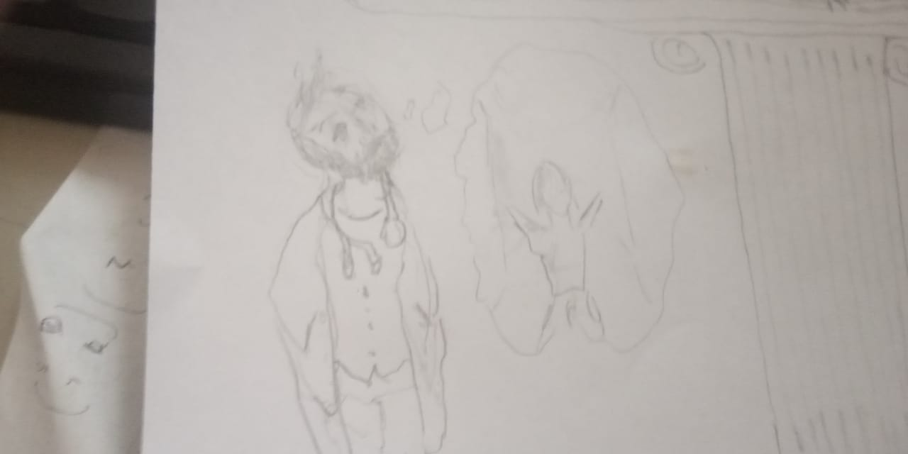

# my first story
Отец пришёл с домой очень молчаливый, он то и дело потирал подбородок и лоб. Даже не переодевшись он налил себе кружку зелёного чая, не положил не ложки сахара, хотя всегда пил чай только с сахаром.  
Сделав пару глотков, он тихо сказал, смотря прямо перед собой, "мы не сможем поехать к бабушке на Новый Год, город оцепили, никому нельзя выезжать и заезжать." 
Больше он ничего не сказал. Мой младший брат заплакал "но, как же мой счастливый конверт с деньгами?! бабушка обещала добавить мне денег на новые кроссовки. Через месяц городской забег!". 
Мой брат, всегда полный энергии, бегал быстрее всех в нашей школе, все полагали на него большие надежды.
В прошлом году он уступил всего секунду победителю, на этот раз этого не должно было повториться, он тренировался так усердно, уходил на пробежку рано утром перед школой и тренировался после занятий.
"Поговорим об этом завтра", сказал отец, он был слишком уставшим, чтобы что либо нам объяснять. И мы с братом знали это. Так как каждую ночь на этой неделе он тихо обсуждал с мамой на кухне, что происходит в его клинике.  Работы много, работать не кому, многие медсёстры тоже заразились и находятся в тяжелом состоянии.
Два человека из его отделения забрали на обследования две недели назад в центральный исследовательский центр, с тех пор никто ничего о них не слышал. Неизвестно количество зараженных и умерших по стране. Всех тяжелых пациентов увозят. Симптомы болезни очень непредсказуемы. Мы уже неделю не выходили на улицу.

